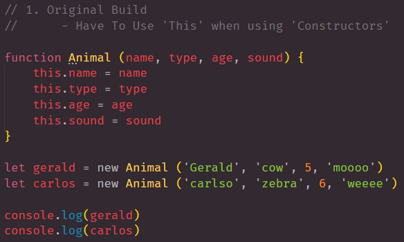

# node105

## About

```
In this repository we focus on 3 main types of Constructors. 
We give example of what a Constructor is and three examples.
    - Original Build for Constructors 
    - Factory Function Constructor 
    - Class Constructors. 
This helps use with big data or application that will consist of a large amount of information. 
```

- - -

## 1. Original Build

> In this section we go over the most common way to build a constructor. 


> Example One



> Results Example One


## 2. Factory Functions

- - -

## 3. Class Constructors 


## LINKS

- [GitHub Repo Link](https://github.com/nicholasd-uci/node105)
- [Nicholas Dallas's GitHub](https://github.com/nicholasd-uci)

- - -
© 2020 NPRD, Nicholas Paul Ruiz Dallas